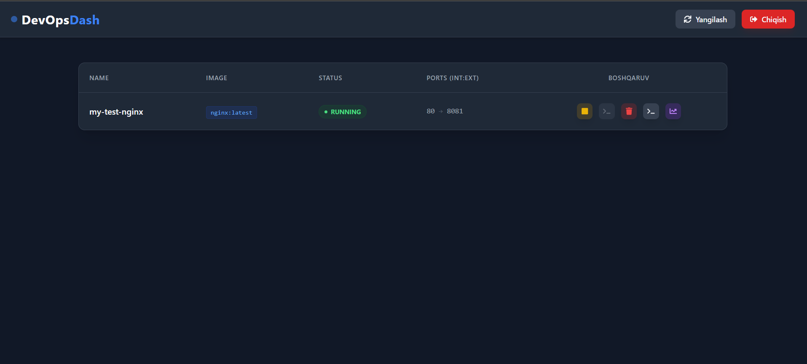

# Mini-PaaS (DevOps Dashboard)


*A lightweight Platform as a Service for Docker container management, monitoring, and real-time log streaming. Empowering developers with Infrastructure as Code and seamless DevOps workflows.*



## 🚀 Features

- **🐳 Docker Container Management**: Create, start, stop, and delete containers directly from the web interface.
- **📊 Real-Time Monitoring**: Live CPU and RAM usage graphs for active containers using Recharts.
- **📝 Log Streaming**: Real-time log viewing in an embedded terminal emulator powered by Xterm.js and WebSockets.
- **⚡ Asynchronous Operations**: Heavy tasks like Docker image pulls handled asynchronously with Celery and Redis.
- **🔐 Secure Authentication**: JWT-based user authentication for secure access.
- **🌐 WebSocket Integration**: Real-time updates via Django Channels for logs and monitoring data.

## 🛠 Tech Stack

### 🧠 Backend & System


### ⚙️ Infrastructure & Integration


### 🗄 Database & Cache


### 🎨 Frontend & UI


### 📊 Advanced UI & Monitoring


## 🏗 System Architecture

The Mini-PaaS platform consists of a **React frontend** for the user interface, a **Django backend** handling API requests and WebSocket connections, and **Celery workers** for asynchronous tasks. Docker SDK integrates directly with the host's Docker Engine via Unix sockets for container operations. Redis serves as both a message broker for Celery and a cache for real-time data. The system supports multi-stage Docker builds for efficient deployment and optional Nginx for production serving.

**High-Level Flow**:
1. User interacts with the React dashboard to manage containers.
2. API calls are sent to Django REST Framework endpoints.
3. Asynchronous tasks (e.g., pulling images) are queued via Celery and Redis.
4. Real-time logs and stats are streamed via WebSockets using Django Channels.
5. Docker operations are performed securely through the SDK.

## 📦 Installation & Setup

### Prerequisites
- Docker and Docker Compose installed on your system.
- At least 4GB RAM and 2 CPU cores recommended for smooth operation.

### Quick Start
1. **Clone the repository**:
   ```bash
   git clone https://github.com/Samandar2005/Devops-dash.git
   cd Devops-dash
   ```

2. **Environment Configuration**:
   - Copy `.env.example` to `.env` and configure your settings (e.g., database credentials, JWT secrets).

3. **Build and Run with Docker Compose**:
   ```bash
   docker-compose up --build
   ```
   This will start the backend, frontend, Redis, PostgreSQL, and Celery services.

4. **Access the Application**:
   - Frontend: [http://localhost:3000](http://localhost:3000)
   - Backend API: [http://localhost:8000](http://localhost:8000)
   - API Documentation: [http://localhost:8000/swagger/](http://localhost:8000/swagger/) (via DRF-YASG)

5. **Initial Setup**:
   - Create a superuser: `docker-compose exec backend python manage.py createsuperuser`
   - Run migrations if needed: `docker-compose exec backend python manage.py migrate`

### Development Mode
For local development without Docker:
- Backend: `cd backend && pip install -r requirements.txt && python manage.py runserver`
- Frontend: `cd frontend && npm install && npm run dev`

## 🔮 Future Improvements

- **Kubernetes Integration**: Extend support for Kubernetes clusters alongside Docker.
- **Multi-Node Deployment**: Add support for distributed container orchestration.
- **Advanced Monitoring**: Integrate Prometheus and Grafana for comprehensive metrics.
- **CI/CD Pipelines**: Built-in pipeline management for automated deployments.
- **Role-Based Access Control**: Granular permissions for team collaboration.
- **Cloud Provider Support**: Direct integration with AWS ECS, Google Cloud Run, etc.

## 👨‍💻 Author

**Your Name**  
Middle Backend Developer  
- **LinkedIn**: (https://www.linkedin.com/in/samandar-boriyev/)  
- **Email**: samandarboriyev2005@gmail.com  

*This project showcases expertise in backend development, DevOps practices, and system integration. Built with passion for simplifying infrastructure management.*
